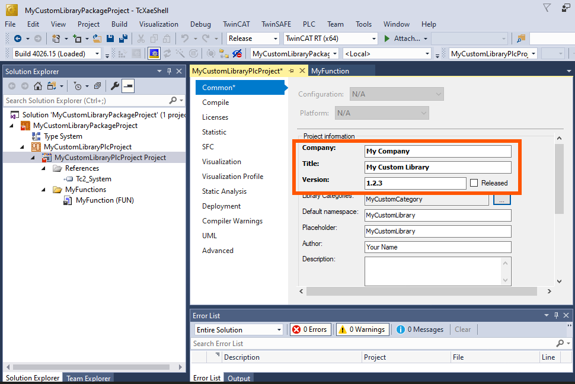

# PLC library package

Delivers a compiled TwinCAT PLC library (`.library`) to engineering stations and registers it in
the local library repository, so it can be referenced from any PLC project.

| | |
| --- | --- |
| **Package ID** | `MyCustomLibraryPackage` |
| **Variant** | `VariantXAE` — engineering systems |
| **Target** | Local PLC library repository |
| **Mechanism** | `RepTool.exe --installLib` |
| **Side-by-side versions** | Yes (`AllowMultipleVersions`) |

---

## What the package does

On install it runs TwinCAT's library repository tool, `RepTool.exe`, which imports the shipped
`.library` file into the local library repository. Afterwards the library appears in **Library
Repository** in TwinCAT XAE and can be added to any PLC project via *References → Add library*.

On uninstall the same tool removes the library again, identified by its repository name
`Name, Version (Vendor)`.

Because the package carries the `AllowMultipleVersions` tag, several versions can coexist — which
matters for libraries, since different projects legitimately pin different versions.

## When to use it

- Distributing an in-house PLC library (motion primitives, communication wrappers, site standards)
  across a team without emailing `.library` files around.
- Making library versions **reproducible**: a machine's installed package set fully determines
  which library versions are available.
- Shipping a library to customers or system integrators through your own feed.
- As a building block for a [workload](../plc-library-workload) that installs a whole library set
  at once.

---

## Contents

```
plc-library-package/
├── README.md
├── src/                                       # Everything here goes into the .nupkg
│   ├── MyCustomLibraryPackage.nuspec           # Package manifest
│   ├── MyCustomLibraryPlcProject.library       # The compiled library (the payload)
│   ├── PackageIcon.png                         # Icon shown in the Package Manager UI
│   └── tools/
│       ├── chocolateyinstall.ps1               # Installs the library via RepTool.exe
│       ├── chocolateyuninstall.ps1             # Uninstalls the library via RepTool.exe
│       ├── chocolateybeforemodify.ps1          # Clears the managed library cache
│       ├── LICENSE.txt                         # License of the shipped library
│       └── VERIFICATION.txt                    # How to verify the payload
└── twincat-library-src/                        # Source project the .library was built from
    └── MyCustomLibraryPackageProject/           (reference only, not packed)
```

`twincat-library-src` is included for completeness so you can see how the library was produced.
Only `src/` ends up in the package.

---

## How it works

### `chocolateyinstall.ps1`

1. Resolves the payload next to the script:
   ```powershell
   $toolsDir     = Split-Path -Parent $MyInvocation.MyCommand.Definition
   $fileLocation = Join-Path $toolsDir "MyCustomLibraryPlcProject.library"
   ```
2. Reads the TwinCAT root from `HKCU:\SOFTWARE\Beckhoff\TwinCAT3\TwinCATDir`.
3. Finds `RepTool.exe`, which lives in a build-specific folder:
   ```
   <TwinCATDir>\3.1\Components\Plc\Build_4026.*\Common\RepTool.exe
   ```
   Matches are sorted and the **highest build number** is used.
4. Derives the PLC profile name (`Build_4026.x.y`) from that path.
5. Runs the tool and waits for it:
   ```powershell
   RepTool.exe --profile="TwinCAT PLC Control_Build_4026.x.y" --installLib "<path>.library"
   ```

### `chocolateyuninstall.ps1`

Same discovery logic, but calls `--uninstallLib` with the library's repository identifier:

```powershell
$LibraryName    = "My Custom Library"
$LibraryVersion = "1.2.3"
$LibraryVendor  = "My Company"

# -> "My Custom Library, 1.2.3 (My Company)"
```

### `chocolateybeforemodify.ps1`

Deletes the cached library metadata so a freshly installed version is picked up immediately:

```
%ProgramData%\Beckhoff\TwinCAT\PlcEngineering\Managed Libraries\cache*
```

Without this, XAE can keep showing stale repository content after an upgrade.

---

## ⚠️ Keeping the version in sync

`RepTool.exe` identifies a library by **`Name, Version (Vendor)`** — values that come from the
library project's *Project Information*, **not** from the `.nuspec`.

That means three places must agree:

| Value | Source of truth | Also appears in |
| --- | --- | --- |
| Library name | PLC project → Project Information → `Title` | `chocolateyuninstall.ps1` → `$LibraryName` |
| Library version | PLC project → Project Information → `Version` | `chocolateyuninstall.ps1` → `$LibraryVersion`, `.nuspec` → `<version>` |
| Library vendor | PLC project → Project Information → `Company` | `chocolateyuninstall.ps1` → `$LibraryVendor` |



If they drift apart, the package installs cleanly but **cannot be uninstalled** — `RepTool.exe`
will not find a matching entry. `build/set-version.ps1` warns when a lifecycle script still
references the previous version.

---

## Building

```powershell
# From the repository root
.\build\pack.ps1 -Sample plc-library-package

# Or directly
tcpkg pack "samples\plc-library-package\src\MyCustomLibraryPackage.nuspec" -o "C:\LocalFeed"
```

## Installing

```powershell
tcpkg source add -n "My Local Feed" -s "C:\LocalFeed"   # once per machine
tcpkg config unset -n VerifySignatures                   # once, dev machines only
tcpkg install MyCustomLibraryPackage
```

The library is now available in TwinCAT XAE under **Library Repository**.

## Uninstalling

```powershell
tcpkg uninstall MyCustomLibraryPackage
```

---

## Adapting it to your own library

1. **Build your library.** In TwinCAT XAE, set *Project Information* (Company, Title, Version) on
   the PLC project, then *Save as library…* — or *Save as compiled library…* to ship source-protected
   code.

2. **Replace the payload.** Put your `.library` next to the `.nuspec` in `src/` and update the
   mapping:
   ```xml
   <file src="YourLibrary.library" target="tools\YourLibrary.library" />
   ```

3. **Update the install script:**
   ```powershell
   $libraryFileName = "YourLibrary.library"
   ```

4. **Update the uninstall script** with the values from *Project Information*:
   ```powershell
   $LibraryName    = "Your Library"
   $LibraryVersion = "1.0.0"
   $LibraryVendor  = "Your Company"
   ```

5. **Update the manifest** — `<id>`, `<version>`, `<title>`, `<authors>`, `<description>`, and the
   `Category` tag. Keep `AllowMultipleVersions` and `VariantXAE`.

6. **Update `LICENSE.txt` and `VERIFICATION.txt`** to describe your library.

7. **Pack, publish, test**:
   ```powershell
   .\build\pack.ps1 -Sample plc-library-package -OutputDirectory C:\LocalFeed
   tcpkg install YourLibraryPackage
   tcpkg uninstall YourLibraryPackage
   ```
   Always test the uninstall — that is where a name/version mismatch shows up.

### Releasing a new version

```powershell
# 1. Rebuild the library in XAE with the new version in Project Information
# 2. Replace src\YourLibrary.library
# 3. Bump the manifest
.\build\set-version.ps1 -Sample plc-library-package -Version 1.3.0
# 4. Update $LibraryVersion in tools\chocolateyuninstall.ps1  (the script above warns about this)
# 5. Repack
.\build\pack.ps1 -Sample plc-library-package -OutputDirectory C:\LocalFeed
```

---

## Troubleshooting

| Symptom | Cause | Fix |
| --- | --- | --- |
| `RepTool.exe not found in expected TwinCAT directories.` | TwinCAT 4026 not installed, or the PLC component is missing | Verify `HKCU:\SOFTWARE\Beckhoff\TwinCAT3\TwinCATDir` and that `Components\Plc\Build_4026.*` exists |
| Install succeeds, library not visible in XAE | Stale repository cache | Restart XAE; confirm `chocolateybeforemodify.ps1` cleared `%ProgramData%\Beckhoff\TwinCAT\PlcEngineering\Managed Libraries\cache*` |
| Uninstall reports success, library stays | `Name, Version (Vendor)` in the script does not match the repository entry | Compare with *Library Repository* in XAE and correct the three variables |
| `Could not find TwinCAT base path in registry.` | Script ran as a different user (the key is in `HKCU`) | Run the install in the context of the engineering user |

---

## See also

- [`docs/lifecycle-scripts.md`](../../docs/lifecycle-scripts.md) — `RepTool.exe` usage in detail
- [`docs/nuspec-reference.md`](../../docs/nuspec-reference.md) — `AllowMultipleVersions` and the tag vocabulary
- [PLC library workload](../plc-library-workload) — bundling several library packages
